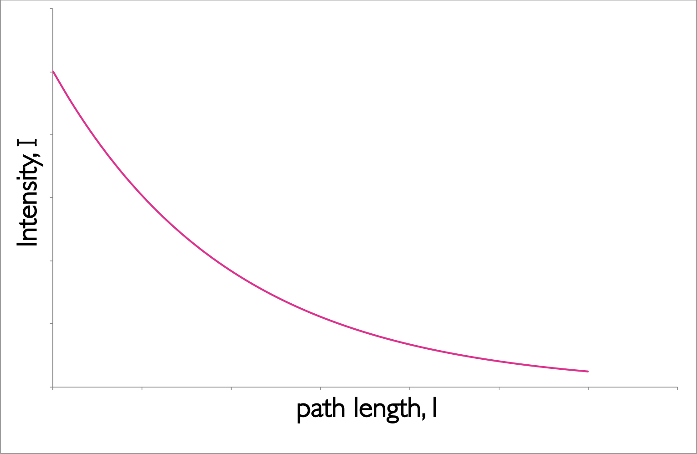
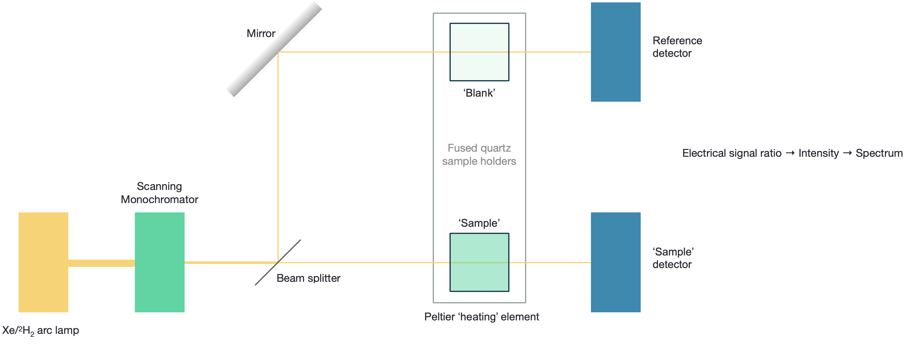
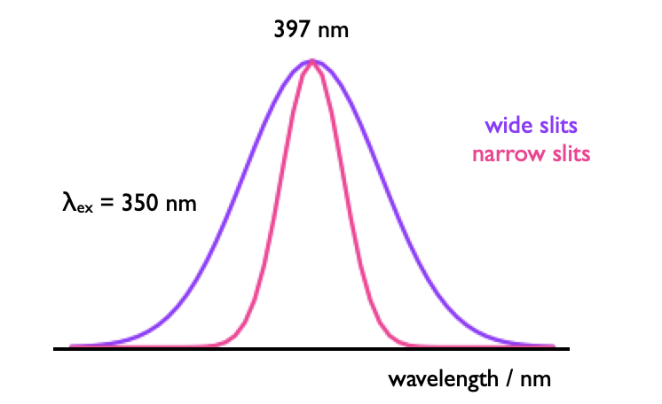
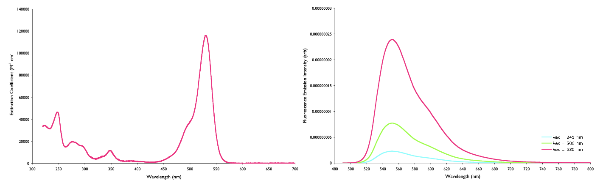

# Basic Spectroscopies {#ch:UVvisfluorIR}

Please scroll to the bottom to find a summary video on UV/vis and fluroescence spectroscopy.

## UV/Vis {#sec:UV}

### The Beer-Lambert Law

The intensity of incident light ($I_0$) passing through a sample falls exponentially, this is described by the Beer-Lambert Law. The empirical equation (equation \@ref(eq:BeerLambert), figure \@ref(fig:BeerLambert)) implies that the probability of a photon being absorbed at any point is the same (much like first order kinetics), and the amount of the total absorption depends upon the the concentration of the sample, c, and the ‘path length’, l. 

The amount of absorbance, A, is dependent upon the wavelength of the incident light, and the constant of proportionality, $\varepsilon$ (here called the molar extinction coefficient), is consequently also wavelength dependent.

\begin{equation}
\log \frac{I_0}{I}=A=\varepsilon cl
(\#eq:BeerLambert)
\end{equation}

The wavelength of a particular value of the molar exctinction coefficient is often represted as a subscript, $\varepsilon _\lambda$

```{r echo=FALSE, BeerLambert, out.width='50%', fig.show='hold', fig.align='center', fig.cap='The decay of intensity of monochromatic incident light through a uniformly absorbing medium. The decay follows an exponential pattern as elucidated in the Beer-Lambert equation.'}

```

The Beer-Lambert law makes a number of assumptions, and this exponential decay of the intensity of light is an important factor.When using the Beer-Lambert law you consider the intensity of the incident radiation, there is an assumption that the intensity of the radiation reaching each part of the sample does not deviate much from this. Hence high absorbing samples tend to show strong deviation from the Beer-Lambert’s linear relationship.

The Beer-Lambert law also has to make a number of other ‘reasonable’ considerations: 

- The solutions is well mixed, and absorbers are homogeneously distributed in solution.
- The absorbers do not scatter radiation (all particles will Rayleigh and Raman scatter but this is normally considerably less intense than absorption). Consequently solutions should be optically transparent as optically opaque solutions (such as colloidal solutions) have considerably stronger scattering. 
- The absorbers acts independently of each other, this means solutions need to be at a reasonably low concentration (typically less than 0.01 M, or maybe even less depending on the species) so as to avoid electrostatic or $\pi$ stacking interactions between the chromophores.This is in part important because light is only absorbed when the polarisation of the light is aligned with the transition dipole moment. 
- The incident radiation is collimated, and each photon should pass through the same path length. 
- The sample holder (cuvette) is optically ‘pure’ such that reflections are avoided (linked to the assumption above). 
- The incident radiation is monochromatic, or at the very least has a band width more narrow than the band width of the absorbing transition (this is usually not an issue for molecular systems as bandwidths are usually 10s or more of nm wide, but for atomic or ion spectroscopy where bandwidths are <0.02 nm this is a factor which must be carefully considered. 
- The incident radiation does not noticeably affect the concentration of the ground state, in other words the amount of excited states generated must be kept small as when we are talking about the absorption of a chromophore the concentration of that chromophore that appears in the Beer-Lambert equation is the ground state concentration. 
- There is no measurable emission from the sample.


### Using UV/Vis {#sec:usingUV}

These assumptions become important as we start to consider more complicated techniques than the most basic absorption spectrometery, however to ensure we are following these limits on the Beer-Lambert law it is rare for spectroscopists to work with sample absorbances above 0.1 (the point where ~20 \% of the light is absorbed).

To do this either the path length ($l$) is reduced or the concentration ($c$) of the sample is reduced.

UV/vis is simplest to use on solution based systems as the assumption that the transition dipole moments are randomly aligned (the use of non-randomly aligned transition dipole moments is the basis of the technique linear dichroism (LD)).

### The UV/Vis instrument {#sec:UVinstrument}

```{r echo=FALSE, UV, out.width='100%', fig.show='hold', fig.align='center', fig.cap='The UV/Visible spectrophotometer consists of a source of light, wavelength selector, cell holder and detector, however the complexity of each of these is very much dependent upon the instrument used.'}

```

Figure \@ref(fig:UV) shows the schematic of a 'dual beam' UV/Vis spectrophotometer, this would be a higher end instrument.

The most basic versions (and the version you may have used in the lab) are single beam instruments, whereby $I_0$ is determined indirectly. Some instruments use a 'blank path' which does not allow for a 'blank' reference cuvette, to allow light to reach the detector, in this case it is a single detector for both paths, with the beam of light beign selected by use of a rotaing chopper. Historically photodiodes were used as the detectors, however the use of 'echelle' (2-dimensional) diffraction gratings have increasingly meant that CCDs may be used for optaining the whole spectrum instantly.

The use of a heating block for the sample means that a range of interesting studies may occur from the melting of DNA and proteins (see CH30129/CH30217 notes on hypochromicity), and the temperature dependent release of drug molecules. However, this feature again is only on higher end instruments.

## Fluorimeters {#sec:fluorimeter}

```{r echo=FALSE, fluorimeter, out.width='100%', fig.show='hold', fig.align='center', fig.cap='A fluorimeter consists of a source of light, wavelength selector, cell holder and detector, however, just like with UV/Vis instruments the complexity of each of these is very much dependent upon the instrument used.'}

```

Figure \@ref(fig:fluorimeter) shows the schematic of higher end fluorimeter with scanning monochromators for both the excitation and emission. Some lower end instruments may use band pass filters to select a 'single' excitation (and emission) wavelength, or else use a diode as an excitation source. The university uses both of these instrument types in the teaching labs, with the diode instrument using a two dimensional echelle grating such that the full emission spectrum is recorded 'instantly'. The CCD detector is considerably less sensitive than the PMT, but the cost is considerably lower and so they are used in some instruments.

```{r echo=FALSE, sat, out.width='40%', fig.show='hold', fig.align='center', fig.cap='The detectors in fluorimeters may be easily saturated showing a deviation from the linear (Beer-Lambert) relationship you would expect with increasing concentration, this same effect is also seen as you increase the applied potential on the PMT or increase the slitwidth or integration time.'}

```

The detectors in fluorescence spectrometers are easily over saturated (figure \@ref{fig:sat}), therefore it is important to ensure that the response remains within the linear region of the instrument. To do this there are a number of ways that the signal may be reduced, these include:

- reducing the applied potential on the PMT
- closing either the emission and/or excitation slits
- reducing the concentration of the sample
- reducing the path length of the sample
- reducing the integration time (the time each 'sample' is gathered for)
- change the excitation wavelength

PMTs are less sensitive at long wavelengths and so 'corrections' are usually used in this wavelength regime. 

Emission light is recorded at 90º to the incident wavelength radiation to minimise optical artifacts and to separate out the emission from the intense excitation beam. The are usually scattering signals in the emission (from both Raman (inelastically scattered) and frequency halved elastic scattering) these are usually only observed at low fluorescence intensities.

### Emission fluorimetery

When we are talking about fluorescence spectroscopy we are talking about emitted photons, whether they are fluorescent photons, or phosphorescent photons.


Table: (\#tab:phototrans) The excitation and decay pathways in molecules.

| | | |
|:--------------|:---------|:---------|
|*'Allowed transitions'*| | |
|Singlet-singlet absorption <br> Singlet-singlet emission|<br> fluorescence | $S_0 + h \nu \longrightarrow S_1$ <br> $S_1 \longrightarrow S_0 + h \nu '$|
|*'Forbidden transitions'*|||
|Singlet-triplet absorption <br> Triplet-singlet emission|<br> phosphorescence | $S_0 + h \nu \longrightarrow T_1$ <br> $T_1 \longrightarrow S_0 + h \nu ''$|
|*'Other transitions'* | | |
|Internal conversion <br> <Intersystem crossing> <br> <Intersystem crossing>  | (vibrational relaxation) <br> <br> (vibrational relaxation) | $S_1 \longrightarrow S_0 + heat$ <br> $S_1 \longrightarrow T_1 + heat$ <br> $T_1 \longrightarrow S_0 + heat$|
|*Other pathways*| | |
Quenching of excited state <br> <br> <br> Chemistry from excited state| | $S_1 + Q \longrightarrow S_0 + Q +heat$ <br> $S_1 + Q \longrightarrow S_0 + Q^\ast +heat$ <br> $T_1 + Q \longrightarrow S_0 + Q +heat$ <br> $T_1 + Q \longrightarrow S_0 + Q^\ast +heat$ <br> $S_1 \longrightarrow$ new/changed molecule |

Any process that has either emission or scattering of a photon can be seen in the fluorimeter, however scatting is usually considerably weaker and is only an issue at very low emission intensities.

When we think about fluorescence spectroscopy it is usually steady state (constant illumination)emission mode that we think of. In this technique the excitation wavelength is fixed and the emission is scanned.

It is a difficult technique to quantify, and so if comparing samples the same settings (slit width, PMT voltage, $\lambda_{ex}$, scan rate) should be used, and the absorbance of each sample noted at $\lambda_{ex}$.

The wavelength of emmission is calibrated using a water Raman. This is useful as it doesn't matter the purity of the water, and any excitation wavelength may be used (although if 350 nm ($\lambda$~max,em~ = 397 nm) is available this is frequently used for no other reason than tradition). The Raman is an inelastic scattering and so always appears at a well defined wavelength (equation \@ref{eq:waterRaman}).

\begin{equation}
\frac{1}{\lambda_{\textrm{em, µm}}}=\frac{1}{\lambda_{\textrm{ex, µm}}}-0.340 \textrm{ µm}^{-1}
(\#eq:waterRaman)
\end{equation}

Figure \@ref{fig:slitwidth} shows the effect of slit width of the appearance of a water Raman calibration spectrum, the peak is Gaussian in profile and relatively intense so narrow slit widths may be used. This peak can overlay on the emission spectrum, but can manually be removed if necessary.

```{r echo=FALSE, waterRaman, out.width='40%', fig.show='hold', fig.align='center', fig.cap='The Gaussian profile of a water Raman spectrum used to calibrate the emission wavlength in fluorimeters.'}

```

Increasing the integration time improves the signal to noise ratio, but the signal only improves relative to the noise in a $\sqrt{n}$ ratio, so as the integration time increases by four, the signal to noise ratio increases by 2.

### Excitation spectroscopy

More on this technique will be discussed later in the course, but it is a measure of how the emission intensity varies with the excitaiton (or absorbance) of the sample - the technique can show where the excited states in a system come from.

What we do know though is that the emission intensity is very dependent upon the wavelength you excite, as the amount of absorption (and therefore excited states generated) is very dependent on wavelength (figure \@ref{fig:normabs}).


```{r echo=FALSE, normabs, out.width='40%', fig.show='hold', fig.align='center', fig.cap='The intensity of emission depends upon the amount of absorption at the excitation wavelength, however if each of these emission spectra, of rhodamine 6G (right), are divided by the amount of absorbance (left), then the normalised emission is the same in each case.'}

```

The intensity of the source varies a lot with wavelength, and so the excitation detector is used to 'normalise' the emission intensity against the intensity of light generating the excited states.

<iframe width="749" height="421" src="https://www.youtube.com/embed/kx8-nB6D1lU" frameborder="0" allow="accelerometer; autoplay; clipboard-write; encrypted-media; gyroscope; picture-in-picture" allowfullscreen></iframe>

## Questions

1. Why are emission spectra recorded at 90º to the incident light?
  a. emission intensity is most intense normal (at 90º) to the excitation source
  b. 90º is the best angle to separate the Raman signal from the emission signal
  c. it is a good angle to ensure no excitation light makes it to the emission detector
  d. it reduces the amount to reabsorption of light by minimising the path length
  e. it maximises internal reflections, ensuring the most emission from the sample


2. Which of the following is not an assumption of the Beer-Lambert law?

  a. The absorbing molecules must be homogeneously distributed in solution
  b. Incident radiation must be normal to the transition dipole of the molecule
  c. The absorbers must act independently of each other
  d. The incident radiation must be collimated (parallel rays) and pass through the same path length
  e. The incident radiation must have a band width that is more narrow than the absorbing transition
  f. The intensity of incident light must be low to ensure the population of an excited state is negligible
  
  
3. Why does a molecule absorb light; what conditions are needed?

  a. only the energy gap ΔE matters
  b. only the intensity of light matters, with enough light it will always absorb
  c. the extinction coefficient governs how much light will be absorbed
  d. the energy gap and polarisation of the electromagnetic field matter
  e. the solvent molecules must be aligned with the magnetic field
  f. only the polarisation of the magnetic field matters

## Answers
1. Why are emission spectra recorded at 90º to the incident light?
  a. emission intensity is most intense normal (at 90º) to the excitation source
  - Fluorescence should be isotropic in the steady state so no angle has a higher emission intensity
  b. 90º is the best angle to separate the Raman signal from the emission signal
  - Raman like emission is isotropic - the only way you can separate them is using time resolved methods, but Raman is usually considerably less intense than the emission signal.
  c. <span style="color: crimson;"> it is a good angle to ensure no excitation light makes it to the emission detector </span>
  - Incident light passes straight through, any other angle which can separate this would be fine, but 90º is usually used because of the shape of the cuvettes (square)
  d. <span style="color: light coral;"> it reduces the amount to reabsorption of light by minimising the path length</span>
  - This is called the inner filter effect - it can be a problem, and recording at 90º will minimise the path length but the best thing to do is ensure that the concentration, or intensity of incident light (slit width) is reduced
  e. it maximises internal reflections, ensuring the most emission from the sample
  - In a square cuvette it should minimise the effect of internal reflections, this is not something we want as we are assuming the light only travels through the sample once


2. Which of the following is not an assumption of the Beer-Lambert law?

  a. The absorbing molecules must be homogeneously distributed in solution
  b. <span style="color: crimson;">  Incident radiation must be normal to the transition dipole of the molecule </span>
  - This statement is the exact opposite of being homogeneously distributed, only molecules with the transition dipole moment aligned correctly will absorb, but it shouldn’t be that all molecules are aligned 
  c. The absorbers must act independently of each other
  d.The incident radiation must be collimated (parallel rays) and pass through the same path length
  e. The incident radiation must have a band width that is more narrow than the absorbing transition
  f. The intensity of incident light must be low to ensure the population of an excited state is negligible
  
  
3. Why does a molecule absorb light; what conditions are needed?

  a. only the energy gap ΔE matters
  - It matters, it isn’t the only thing…
  b. only the intensity of light matters, with enough light it will always absorb
  - Nope… more power doesn’t work, although you can get some cool non-linear two photon effects with enough power it still has to be the right energy
  c. the extinction coefficient governs how much light will be absorbed
  - Yes, but it isn’t a condition required
  d. <span style="color: crimson;"> the energy gap and polarisation of the electromagnetic field matter </span>
  - Yes the energy gap (wavelength) needs to be appropriate, but the transition dipole moment of that transition of the chromophore must be aligned with the polarisation of the EM light
  e. the solvent molecules must be aligned with the magnetic field
  - The solvent has nothing to do with the transition dipole, it may affect ΔE
  f. only the polarisation of the magnetic field matters
  - Again, it matters that the transition dipole moment and the polarisation of light are matched but for UV/Vis the incident light should be unpolarised
