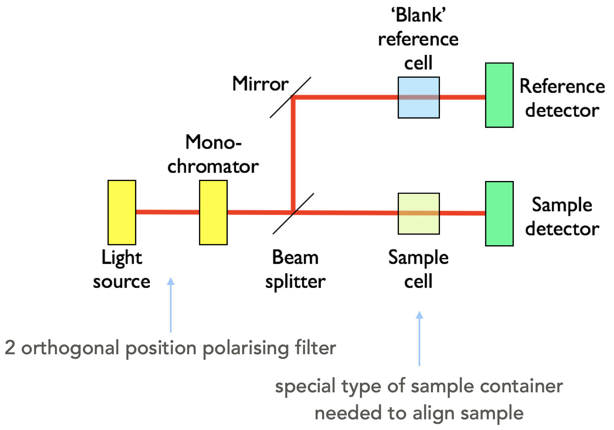
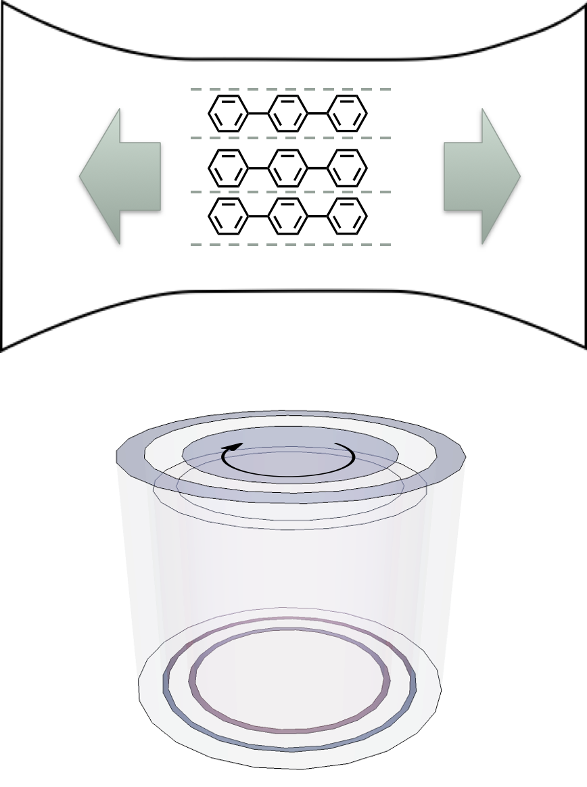
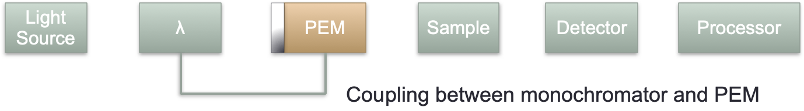
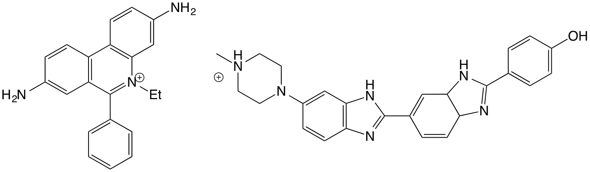
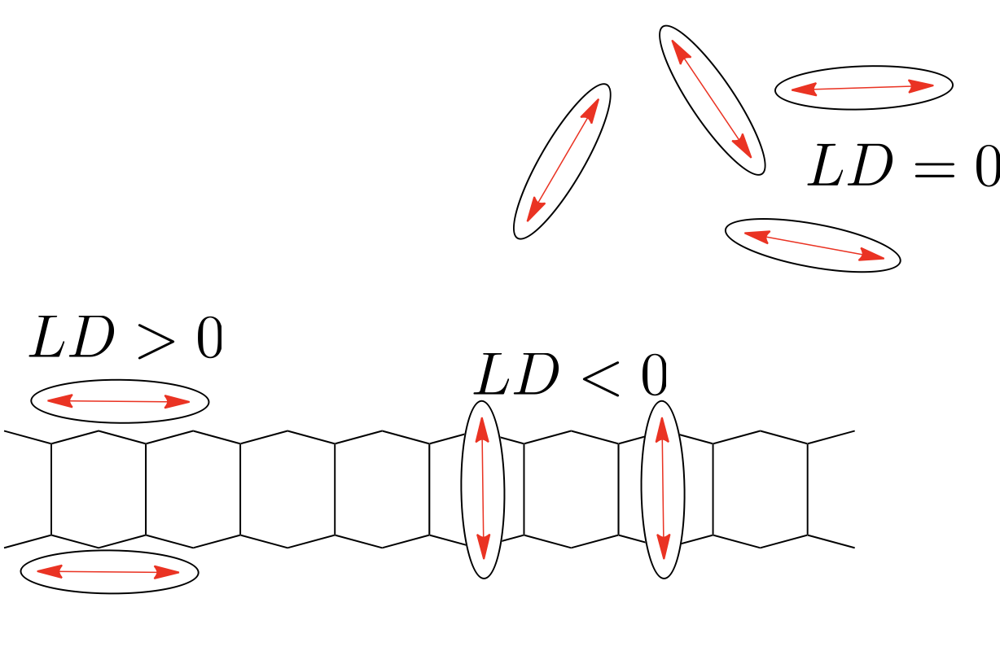
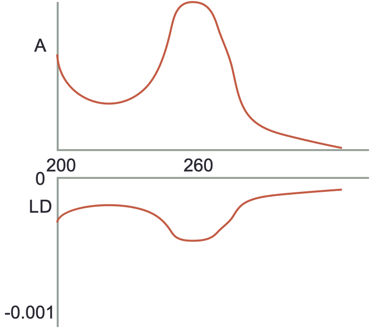

# LD (linear dichroism) and CD (circular dichroism) {#ch:LDCD}

## Linear dichroism {#sec:LD}

<iframe width="749" height="562" src="https://www.youtube.com/embed/D-fpt94OtUc?list=PLLssadGefUKXSIWzqm3iYX12cP1Jh2pYn" frameborder="0" allow="accelerometer; autoplay; clipboard-write; encrypted-media; gyroscope; picture-in-picture" allowfullscreen></iframe>

If we consider the Beer-Lambert law, we have previously said that one of the assumptions of this law is that absorbers are distributed randomly in solution... however, when we look at dichroism techniques, they are actively looking at only exciting molecules aligned with the polarisation.

You will recall that light is only absorbed by a molecule when the polarisation of the light is aligned with the transition dipole moment.

Light is only absorbed by a molecule if the polarisation of the light aligns with the transition dipole moment on the molecule.  Figure \@ref(fig:CS2) shows CS~2~ a simple linear molecule - where the transition dipole moment runs along the long axis of the molecule.

```{r echo=FALSE, CS2, out.width='60%', fig.show='hold', fig.align='center', fig.cap='Carbon disulfide (CS~2~) is a linear molecule -  due to the shape of the molecule there is a transition dipole which runs down the length of the long axis. Light aligned such that the electric field runs parallel with the long axis of the molecule E~||~ will be absorbed, light which in which the electric field runs perpendicular to the long axis of the molecule E~⊥~ will not be absorbed.'}
knitr::include_graphics("images/CS2.png")
```

For more complicated molecules each of the transitions from the HOMO, HOMO-1 to the LUMO *etc.* occur with different transition dipole moments across the chromophore, figure \@ref{fig:adenosine}. Each transition is only excited when light is aligned with that transition; in most cases this isn’t something we need to consider as most incident light we consider is isotropic, but alignment of transition dipoles  (either between light and molecules - or between two different molecules) is an important consideration.

```{r echo=FALSE, adenosine, out.width='100%', fig.show='hold', fig.align='center', fig.cap='The three lowest energy transitions of adenosine each indicated with their transition dipole moment (all in the plane of the molecule, calculated values).These match with the observed spectrum with a weak transition around 310 nm, a much stronger transition around 260 nm and a third transition starting at the edge of the measured spectrum. Spectrum Adapted from OMLC ( https:// omlc.org/spectra/PhotochemCAD/html/033.html), 31st October 2018'}
knitr::include_graphics("images/adenosine.png")
```

As already discussed the transition dipole moment is derived from the difference in electron density of the ground and excited state. 

Linear dichroism uses linearly polarised light and is a measure of the difference in absorbance of the sample between plane polarised light parallel and perpendicular to a reference axis (equation \@ref(eq:LD), figure \@ref(fig:LD)).

\begin{equation}
LD = A_{\parallel} - A_{\perp}
(\#eq:LD)
\end{equation}

```{r echo=FALSE, LD, out.width='60%', fig.show='hold', fig.align='center', fig.cap='A generic LD spectrum to illustrate features of a sample with regions of the spectrum showing a postive LD. An isotropic sample would show 0 LD.'}
knitr::include_graphics("images/LD.png")
```

So if we consider a simple molecular system, that of CS~2~ (figure \@ref(fig:CS2), then light which is polarised in alignment with the long axis of the molecule, $E_{\parallel}$, (which is aligned with the transition dipole moment on the molecule) will be absorbed, whereas light normal to this, $E_{perp}$, will be transmitted as light is passed through the sample. Our dichroism, $LD$, is the difference between these two absorbance values.

This is how polaroid film works where there is a large transition dipole moment along one axis, and a negligable transition dipole along the orthoganol axis.

Adenosine (figure \@ref(fig:adenosine)) is a more typical example, this is an example of a molecule with different transition dipole moments, each with a particular energy and polarisation. We can observe that the different dipole moments absorb more strongly at if we can allign our structure somehow, like in a crystal...

We can relate the linear dichroism to the angle from the reference axis as follows (equation \@ref:LDiso):

\begin{equation}
LD = \frac{3}{2}A_{\textrm{iso}}S(3 \cos^2 \alpha - 1)
(\#eq:LDiso)
\end{equation}

The reduced LD, $LD^r$ is often used as it is concentration indpendent and so differences in the spectrum are easily observed:

\begin{equation}
LD = \frac{A_{\parallel} - A_{\perp}}{A_\textrm{iso}} \frac{3}{2}S(3 \cos^2 \alpha - 1)
(\#eq:LDred)
\end{equation}

The LD spectrophotometer looks a lot like the UV/vis (figure \@ref(fig:LDspec)), however we need to add a two position polarising filter (horizontal and vertical), again just like with the UV there is a blank path (or a dummy blank path and a chopper), with similar light sources to the UV/vis (Xe arc and ^2^D~2~ arc), with the detector again usually being a photodiode.

```{r echo=FALSE, LDspec, out.width='60%', fig.show='hold', fig.align='center', fig.cap='A block diagram of a LD spectrometer including the two position polarising filter.'}

```

If the sample is solution based it will be isotropic unless there is something to help align the molecules, and consequently there will be no LD signal detected. Consequently there needs to be some form of smple alignment, which is usually achieved in one of two methods (figure \@ref{fig:LDcell}):

- small molecules are embedded in a polymer film, which is then stretched in a single direction, this then coaligns the small molecules along the direction of the stretch
- large molecules (such as polymers, DNA and proteins) can be aligned *via* laminar flow. In this case the cuvette is a hollow cylinder with an internal bar which rotates rapidly, this causes laminar flow 

```{r echo=FALSE, LDcell, out.width='60%', fig.show='hold', fig.align='center', fig.cap='In order to show an LD signal there needs to be some alignment of the molecules, two methods are usually used, embedding the molecules in a polymer film and stretching the film, such that the molecules are pulled into alignment (top), or laminar flow, whereby a thin film of solvent is rapidly stired and the molecules align with this flow (like stirring spagetti (bottom)'}

```

## Circular Dichroism

Circular dichroism uses circularly polarised light and looks at the difference between the absorption of left and right hand polarised light. It is much like the use of polarimetry to look at R- and S- enantiomers, but we are combining it with UV, in that a spectrum is scanned and the CD measured over a range of wavelengths.

An excel resource has been provided on moodle (under 'Other Resources') to try to help you understand how two plane waves may be combined to generate circularly polarised light.

<iframe width="749" height="562" src="https://www.youtube.com/embed/P3U9Hhs_eTc?list=PLLssadGefUKXSIWzqm3iYX12cP1Jh2pYn" frameborder="0" allow="accelerometer; autoplay; clipboard-write; encrypted-media; gyroscope; picture-in-picture" allowfullscreen></iframe>

To generate circularly polarised light two orthogonal paths of monochromatic light is passed through a birefringent material (a material with two different refractive indicies depending on the crystal plane). This retards one wave more than the other and when they combine they are out of phase and so combine to form circularly or eliptically polarised light. Calcite is an example of a birefringent material.

The phase offset will depend upon the thickness of the waveplate, the thickness of this plate can be changed by applying an alternating current causing a change in crystal shape due to teh piezoelectric effect. The bigger the potential difference the bigger the change in the size of the crystal, consequently the crystal can always be adjusted (no matter the wavelength) so that the resultant waves are always π/2 (for a quarter wave plate), or π (for a half wave plate) different in phase. This crystal oscillation is caused by a device called the photoelastic modulator.

```{r echo=FALSE, CD, out.width='60%', fig.show='hold', fig.align='center', fig.cap='A block diagram of a CD spectrometer including the coupled monochromator and photoelastic modulator.'}

```

In each 50 Hz cycle we get a measurement of  -λ/4 (L) and +λ/4 (R) light. After passing through a sample the R & L circularly polarised light become eliptical (and when we deconvolute the horizontal and vertical waves are no longer of equal amplitude) these combine to give the CD (equation \@ref(fig:CD)).

\begin{equation}
CD = A_{\textrm{L}} - A_{\textrm{R}}
(\#eq:CD)
\end{equation}

It should be noted that there is a difference of opinion as to what reference frame constitutes left and right as far as the polarisation of light goes, papers will always state their convention.

## Induced Dichroism

Some molecules may themselves not show either LD or CD themselves, but they may have induced dichroism because they are bound to a molecule which does.

```{r echo=FALSE, DNAbinders, out.width='60%', fig.show='hold', fig.align='center', fig.cap='The DNA binders ethidium bromide (left) which intercalates between the base pairs of DNA, and Hoechst 33258 (right) which binds in the minor groove of DNA, by curving around the tertiary structure'}

```

An example of this would be small dye molecules such as YO-Pro-1 (see photochemisry notes and the later workshop materials, and those listed in figure \@ref(fig:DNAbinders) which is a small fluorescent dye molecule which binds to DNA. This molecule itself is achrial, and if introduced into LD with laminar flow is too small to align and so the LD should also be zero. However, when bound to DNA both an LD and CD is observed from the sample because it is now in an environment big enough to align with the laminar flow, and the DNA tertiary structure is chiral and so the dye is binding into a chrial environment and therefore an induced CD is also observed.

For induced LD, if the molecule remains in free solution the transition dipoles are aligned isotopically and no LD is observed. However if we look at binding to DNA as an example, if the molecule intercalates the transition dipole moment will be *more* aligned to be perpendicular to the long axis of the molecule and will therefore display a negative LD. If the molecule has a transition dipole moment principally aligned with the long axis of the molecule then it will display a positive LD (figure \@ref{fig:inducedLD}). 

We can determine the binding angle (with a few added assumptions) by using equation \@ref{eq:LDiso}.

```{r echo=FALSE, inducedLD, out.width='60%', fig.show='hold', fig.align='center', fig.cap='Small molecules under laminar flow are too small to align and so they are aranged isotropically and therefore no LD is observed, however on binding to macromolecules such as DNA the species display an induced LD'}

```

CD may show 'unwinding' (less chirality in the sample) indicating an intercalation of a molecule between the bases of DNA.

Behaviour like this can tell us a lot about drugs binding to biological molecules, in a manner which is relatively quick and simple. 

## Workshop task

You will find some slides containing absorbance, LD and CD of YO-Pro-1 and it's dimer YOYO-1 on Moodle under the CD and LD, alongside these are some questions I want you to think about and answer when looking at the spectra. You should think about general trends and not be too hung up about individual spectra.

When we meet in our next LOIL we will discuss this case study and I will be breaking you into your selected (or assigned) break out groups to discuss our ideas further, we will then wrap up the session with you sharing your group thoughts (so think about nominating a spokesperson).

I do not expect you to know a lot about DNA, just know the following:
  - DNA has a negatively charged backbone
  - By intercalating between the basepais the DNA has to stretch (get longer) and unwind slighly
  - A helix repeats about once every 10 bases, with the bases separated by the van der Waals distance (3.4 Å)
  - The bases are about about 86º to the long axis of the molecule


## Questions

These questions can be used to check your understanding of the material, beware I periodically include star trek inspired technobabble in the distractors...


1. If a molecule is illuminated with polarised light, for it to absorb light:

    a. only the energy gap ΔE matters
    b. only the intensity of light matters, with enough light it will always absorb
    c. the extinction coefficient governs how much light will be absorbed
    d. the energy gap and the orientation of the transition dipole moment matter
    e. the solvent molecules must be aligned with the magnetic field
    f. only the polarisation of the magnetic field matters

2. For a molecule to display CD absorption then:
  a. it must first be excited with polarised light
  b. it must be able to be aligned with the electric field
  c. it must have an inversion centre, i
  d. the instantaneous transition dipole moment must be circularly polarised
  e. the molecule must display a quadrupole in both magnetic and electric fields
  f. there must be chirality in the molecule

3. For a chromophore to display induced CD absorption then:
  a. there must be a strong matrix coupling element between the chromophore and the molecule to which it is binding
  b. the chromophore must have a chiral centre
  c. the instantaneous dipole on the chromophore must interact with the electric field of the molecule to which it is binding
  d. the absorption wavelengths of both the chromophore and chiral molecule must overlap
  e. there must be a strong overlap integral between the emission of the chiral molecule and the absorption of the molecule to which it is binding
  f. it must be free in solution
  g. the chromophore must be bound in such a way to a chiral molecule that it takes on chiral optical properties

4. If a molecule has an absorbance and LD as shown below then:

```{r echo=FALSE, LDquestion, out.width='60%', fig.show='hold', fig.align='center', fig.cap='Isotopic absorbance (top) and LD (bottom)'}

```

  a. the molecule is isotropically distributed in solution
  b. there is only a single transition within the molecule
  c. the molecule is principally aligned parallel to the plane of polarised light
  d. the molecule is principally aligned perpendicular to the plane of polarised light
  e. the transition moments are aligned more parallel to the plane of polarised light
  f. the transition moments are aligned more perpendicular to the plane of polarised light
  g. the sample is degrading under UV light


## Answers

1. If a molecule is illuminated with polarised light, for it to absorb light:

  a. only the energy gap ΔE matters
  - Again, it matters, it isn’t the only thing…
  b. only the intensity of light matters, with enough light it will always absorb
  - Still not true
  c. the extinction coefficient governs how much light will be absorbed
  - It does, but it isn’t what matters most it just says how much light will be absorbed
  d. the energy gap and the orientation of the transition dipole moment matter
  - This is the one
  e. the solvent molecules must be aligned with the magnetic field
  - Still drivel 
  f. only the polarisation of the magnetic field matters
  - This time this one matters, but it isn’t the only thing…

2. For a molecule to display CD absorption then:
  a. it must first be excited with polarised light
  - If it was first excited with polarised light we would be looking at a transient species not the ground state
  b. it must be able to be aligned with the electric field
  - For a molecule to absorb there must be alignment of the transition dipole moment with the incident light, but nothing in particular with the CD is unique
  c. it must have an inversion centre, i
  - If a molecule has an inversion centre it is NOT chiral
  d. the instantaneous transition dipole moment must be circularly polarised
  - Ooooh-oooooooooh-oh-oh-oh-oh-oooooh the gibberish star trek answer
  e. the molecule must display a quadrupole in both magnetic and electric fields
  - Ooooh-oooooooooh-oh-oh-oh-oh-oooooh the gibberish star trek answer - oooh two!
  f. there must be chirality in the molecule
  - Yup - CD only works with chiral molecules (or molecules in a chiral environment (induced CD))

3. For a chromophore to display induced CD absorption then:
  a. there must be a strong matrix coupling element between the chromophore and the molecule to which it is binding
  - Ooooh-oooooooooh-oh-oh-oh-oh-oooooh the gibberish star trek answer
  b. the chromophore must have a chiral centre
  - This will display CD not induced CD
  c. the instantaneous dipole on the chromophore must interact with the electric field of the molecule to which it is binding
  - This would be a dipole induced dipole interaction - back to first year bonding theory
  d. the absorption wavelengths of both the chromophore and chiral molecule must overlap
  - No reason for this to be true, if they are it would just complicate the spectrum
  e. there must be a strong overlap integral between the emission of the chiral molecule and the absorption of the molecule to which it is binding
  - Nope, no reason for this to be true
  f. it must be free in solution
  - No induced CD if free in solution
  g. the chromophore must be bound in such a way to a chiral molecule that it takes on chiral optical properties
  - Yes the chiral choromophore must be in a chiral environment
  
4. If a molecule has an absorbance and LD as shown below then:
  a. the molecule is isotropically distributed in solution
  - the LD would be 0
  b. there is only a single transition within the molecule
  - this is more likely to be observed by multiple distinct bands in the spectrum
  c. the molecule is principally aligned parallel to the plane of polarised light
  - the transition dipole in the molecule has to be aligned with the plane of polarised to absorb
  d. the molecule is principally aligned perpendicular to the plane of polarised light
  - ditto
  e. the transition moments are aligned more parallel to the plane of polarised light
  - this would have a postive LD
  f. the transition moments are aligned more perpendicular to the plane of polarised light
  - yes this one
  g. the sample is degrading under UV light
  - gibberish

