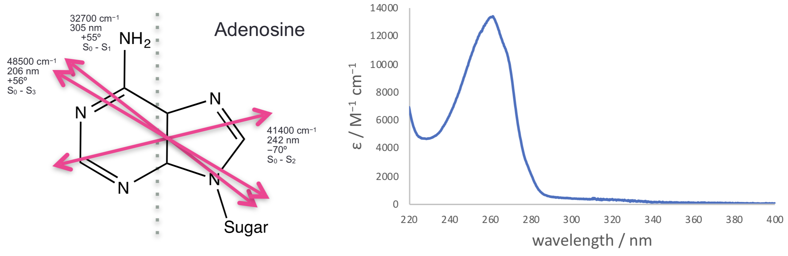
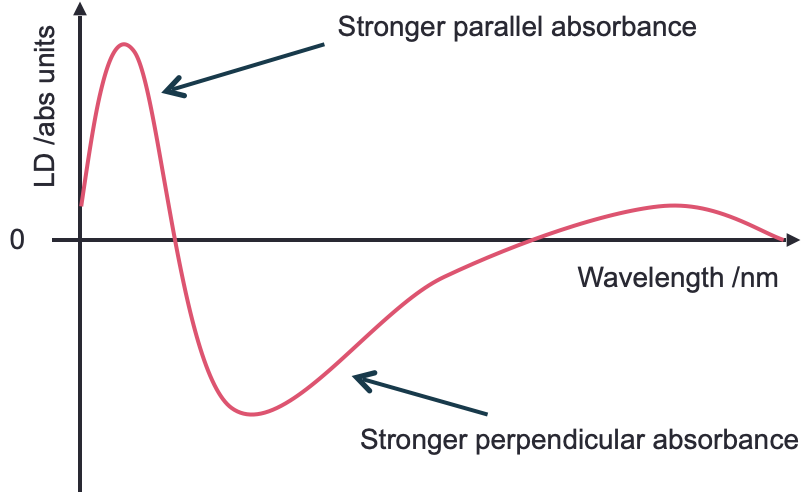

# LD (linear dichroism) and CD (circular dichroism) {#ch:LDCD}

## Linear dichroism {#sec:LD}

If we consider the Beer-Lambert law, we have previously said that one of the assumptions of this law is that absorbers are distributed randomly in solution... however, when we look at dichroism techniques, they are actively looking at only exciting molecules aligned with the polarisation.

You will recall that light is only absorbed by a molecule when the polarisation of the light is aligned with the transition dipole moment.

Light is only absorbed by a molecule if the polarisation of the light aligns with the transition dipole moment on the molecule.  Figure \@ref(fig:CS2) shows CS~2~ a simple linear molecule - where the transition dipole moment runs along the long axis of the molecule.

```{r echo=FALSE, CS2, out.width='60%', fig.show='hold', fig.align='center', fig.cap='Carbon disulfide (CS~2~) is a linear molecule -  due to the shape of the molecule there is a transition dipole which runs down the length of the long axis. Light aligned such that the electric field runs parallel with the long axis of the molecule E~||~ will be absorbed, light which in which the electric field runs perpendicular to the long axis of the molecule E~⊥~ will not be absorbed.'}
knitr::include_graphics("images/CS2.png")
```

For more complicated molecules each of the transitions from the HOMO, HOMO-1 to the LUMO *etc.* occur with different transition dipole moments across the chromophore, figure \@ref{fig:adenosine}. Each transition is only excited when light is aligned with that transition; in most cases this isn’t something we need to consider as most incident light we consider is isotropic, but alignment of transition dipoles  (either between light and molecules - or between two different molecules) is an important consideration.

```{r echo=FALSE, adenosine, out.width='100%', fig.show='hold', fig.align='center', fig.cap='The three lowest energy transitions of adenosine each indicated with their transition dipole moment (all in the plane of the molecule, calculated values).These match with the observed spectrum with a weak transition around 310 nm, a much stronger transition around 260 nm and a third transition starting at the edge of the measured spectrum. Spectrum Adapted from OMLC ( https:// omlc.org/spectra/PhotochemCAD/html/033.html), 31st October 2018'}

```

As already discussed the transition dipole moment is derived from the difference in electron density of the ground and excited state. 

Linear dichroism uses linearly polarised light and is a measure of the difference in absorbance of the sample between plane polarised light parallel and perpendicular to a reference axis (equation \@ref(eq:LD), figure \@ref(fig:LD)).

\begin{equation}
LD = A_{\parallel} - A_{\perp}
(\#eq:LD)
\end{equation}

```{r echo=FALSE, LD, out.width='60%', fig.show='hold', fig.align='center', fig.cap='A generic LD spectrum to illustrate features of a sample with regions of the spectrum showing a postive LD. An isotropic sample would show 0 LD.'}

```
