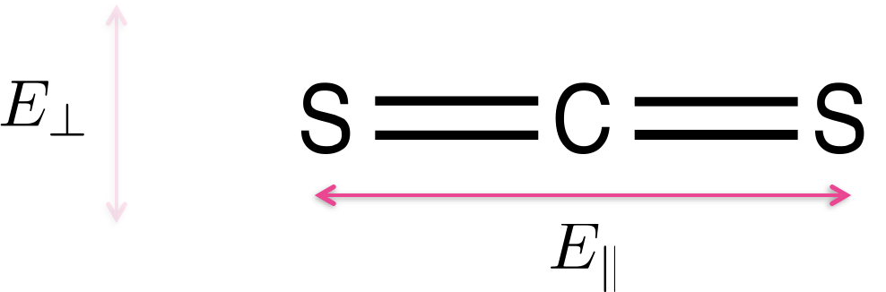

# LD (linear dichroism) and CD (circular dichroism) {#ch:LDCD}

## Linear dichroism {#sec:LD}

<iframe width="749" height="562" src="https://www.youtube.com/embed/D-fpt94OtUc?list=PLLssadGefUKXSIWzqm3iYX12cP1Jh2pYn" frameborder="0" allow="accelerometer; autoplay; clipboard-write; encrypted-media; gyroscope; picture-in-picture" allowfullscreen></iframe>

If we consider the Beer-Lambert law, we have previously said that one of the assumptions of this law is that absorbers are distributed randomly in solution... however, when we look at dichroism techniques, they are actively looking at only exciting molecules aligned with the polarisation.

You will recall that light is only absorbed by a molecule when the polarisation of the light is aligned with the transition dipole moment.

Light is only absorbed by a molecule if the polarisation of the light aligns with the transition dipole moment on the molecule.  Figure \@ref(fig:CS2) shows CS~2~ a simple linear molecule - where the transition dipole moment runs along the long axis of the molecule.

```{r echo=FALSE, CS2, out.width='60%', fig.show='hold', fig.align='center', fig.cap='Carbon disulfide (CS~2~) is a linear molecule -  due to the shape of the molecule there is a transition dipole which runs down the length of the long axis. Light aligned such that the electric field runs parallel with the long axis of the molecule E~||~ will be absorbed, light which in which the electric field runs perpendicular to the long axis of the molecule E~⊥~ will not be absorbed.'}

```

For more complicated molecules each of the transitions from the HOMO, HOMO-1 to the LUMO *etc.* occur with different transition dipole moments across the chromophore, figure \@ref{fig:adenosine}. Each transition is only excited when light is aligned with that transition; in most cases this isn’t something we need to consider as most incident light we consider is isotropic, but alignment of transition dipoles  (either between light and molecules - or between two different molecules) is an important consideration.

```{r echo=FALSE, adenosine, out.width='100%', fig.show='hold', fig.align='center', fig.cap='The three lowest energy transitions of adenosine each indicated with their transition dipole moment (all in the plane of the molecule, calculated values).These match with the observed spectrum with a weak transition around 310 nm, a much stronger transition around 260 nm and a third transition starting at the edge of the measured spectrum. Spectrum Adapted from OMLC ( https:// omlc.org/spectra/PhotochemCAD/html/033.html), 31st October 2018'}
knitr::include_graphics("images/adenosine.png")
```

As already discussed the transition dipole moment is derived from the difference in electron density of the ground and excited state. 

Linear dichroism uses linearly polarised light and is a measure of the difference in absorbance of the sample between plane polarised light parallel and perpendicular to a reference axis (equation \@ref(eq:LD), figure \@ref(fig:LD)).

\begin{equation}
LD = A_{\parallel} - A_{\perp}
(\#eq:LD)
\end{equation}

```{r echo=FALSE, LD, out.width='60%', fig.show='hold', fig.align='center', fig.cap='A generic LD spectrum to illustrate features of a sample with regions of the spectrum showing a postive LD. An isotropic sample would show 0 LD.'}
knitr::include_graphics("images/LD.png")
```

So if we consider a simple molecular system, that of CS~2~ (figure \@ref(fig:CS2), then light which is polarised in alignment with the long axis of the molecule, $E_{\parallel}$, (which is aligned with the transition dipole moment on the molecule) will be absorbed, whereas light normal to this, $E_{perp}$, will be transmitted as light is passed through the sample. Our dichroism, $LD$, is the difference between these two absorbance values.

This is how polaroid film works where there is a large transition dipole moment along one axis, and a negligable transition dipole along the orthoganol axis.

Adenosine (figure \@ref(fig:adenosine)) is a more typical example, this is an example of a molecule with different transition dipole moments, each with a particular energy and polarisation. We can observe that the different dipole moments absorb more strongly at if we can allign our structure somehow, like in a crystal...

We can relate the linear dichroism to the angle from the reference axis as follows (equation \@ref:LDiso):

\begin{equation}
LD = \frac{3}{2}A_{\textrm{iso}}S(3 \cos^2 \alpha - 1)
(\#eq:LDiso)
\end{equation}

The LD spectrophotometer looks a lot like the UV/vis (figure \@ref(fig:LDspec)), however we need to add a two position polarising filter (horizontal and vertical), again just like with the UV there is a blank path (or a dummy blank path and a chopper), with similar light sources to the UV/vis (Xe arc and ^2^D~2~ arc), with the detector again usually being a photodiode.

```{r echo=FALSE, LDspec, out.width='60%', fig.show='hold', fig.align='center', fig.cap='A blck diagram of a LD spectrometer including the two position polarising filter.'}

```

If the sample is solution based it will be isotropic unless there is something to help align the molecules, and consequently there will be no LD signal detected. Consequently there needs to be some form of smple alignment, which is usually achieved in one of two methods (figure \@ref{fig:LDcell}):

- small molecules are embedded in a polymer film, which is then stretched in a single direction, this then coaligns the small molecules along the direction of the stretch
- large molecules (such as polymers, DNA and proteins) can be aligned *via* laminar flow. In this case the cuvette is a hollow cylinder with an internal bar which rotates rapidly, this causes laminar flow 

```{r echo=FALSE, LDcell, out.width='60%', fig.show='hold', fig.align='center', fig.cap='In order to show an LD signal there needs to be some alignment of the molecules, two methods are usually used, embedding the molecules in a polymer film and stretching the film, such that the molecules are pulled into alignment (top), or laminar flow, whereby a thin film of solvent is rapidly stired and the molecules align with this flow (like stirring spagetti (bottom)'}
knitr::include_graphics("images/LDcell.png")
```


## Circular Dichroism

<iframe width="749" height="562" src="https://www.youtube.com/embed/P3U9Hhs_eTc?list=PLLssadGefUKXSIWzqm3iYX12cP1Jh2pYn" frameborder="0" allow="accelerometer; autoplay; clipboard-write; encrypted-media; gyroscope; picture-in-picture" allowfullscreen></iframe>

## Induced Dichroism

Some molecules may themselves not show either LD or CD themselves, but they may have induced dichroism because they are bound to a molecule which does.

An example of this would be small dye molecules such as YO-Pro-1 (see photochemisry notes and the later workshop materials) which is a small fluorescent dye molecule which binds to DNA. This molecule itself is achrial, and if introduced into LD with laminar flow is too small to align and so the LD should also be zero. However, when bound to DNA both an LD and CD is observed from the sample because it is now in an environment big enough to align with the laminar flow, and 

## Workshop task

You will find some slides containing absorbance, LD and CD of YO-Pro-1 and it's dimer YOYO-1 on Moodle under the CD and LD, alongside these are some questions I want you to think about and answer when looking at the spectra. You should think about general trends and not be too hung up about individual spectra.

When we meet in our next LOIL we will discuss this case study and I will be breaking you into your selected (or assigned) break out groups to discuss our ideas further, we will then wrap up the session.


## Questions
1. If a molecule is illuminated with polarised light, for it to absorb light:

  a. only the energy gap ΔE matters
  b. only the intensity of light matters, with enough light it will always absorb
  c. the extinction coefficient governs how much light will be absorbed
  d. the energy gap and the orientation of the transition dipole moment matter
  e. the solvent molecules must be aligned with the magnetic field
  f. only the polarisation of the magnetic field matters


## Answers

1. If a molecule is illuminated with polarised light, for it to absorb light:

  a. only the energy gap ΔE matters
  - Again, it matters, it isn’t the only thing…
  b. only the intensity of light matters, with enough light it will always absorb
  - Still not true
  c. the extinction coefficient governs how much light will be absorbed
  - It does, but it isn’t what matters most it just says how much light will be absorbed
  d. the energy gap and the orientation of the transition dipole moment matter
  - This is the one
  e. the solvent molecules must be aligned with the magnetic field
  - Still drivel 
  f. only the polarisation of the magnetic field matters
  - This time this one matters, but it isn’t the only thing…


