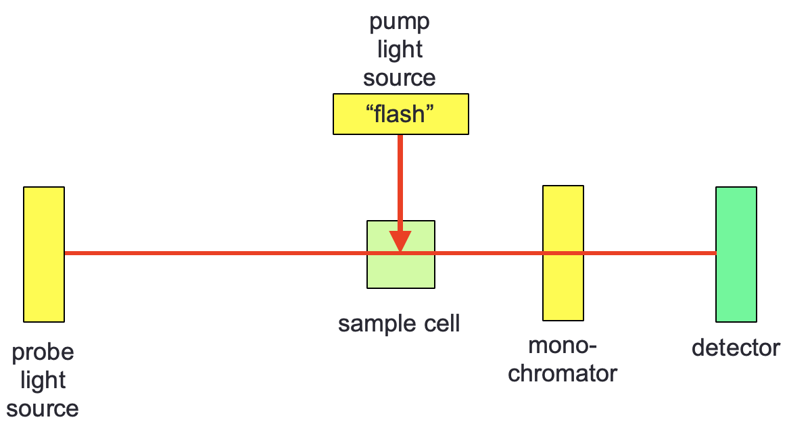
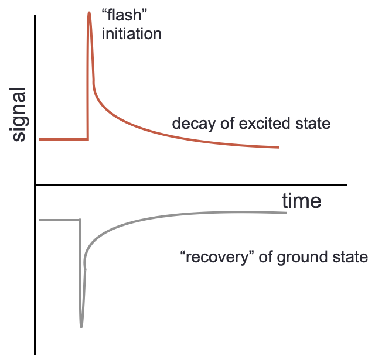
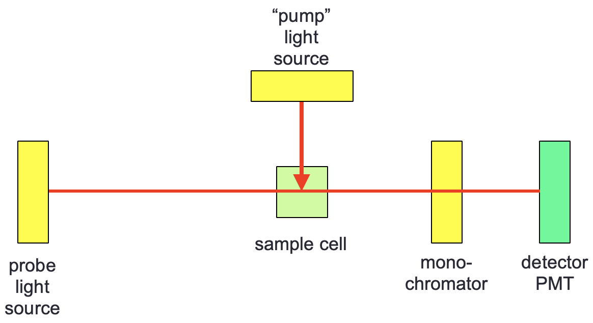
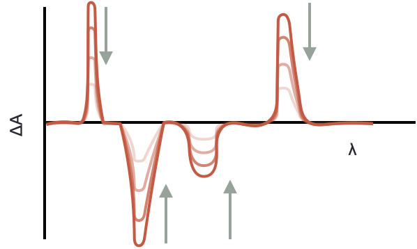
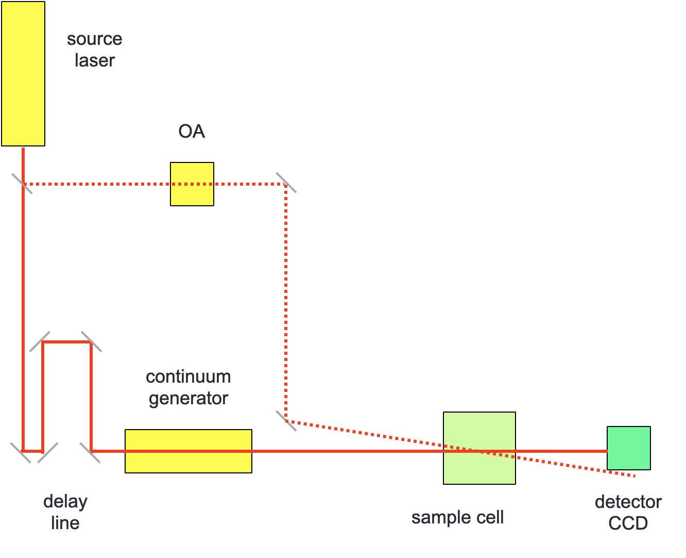

# TA Transient Absorption {#ch:TA}

Transient absorption is a technique which looks at the absorption of an excited state (and consequently also the loss (or bleaching) of the ground state, Table \@ref(tab:phototrans)). 

## Flash photolysis

The technique is based off the single wavelength time resolved technique flash photolysis which was developed by, and won the Nobel Prize for, George Porter and Ronald Norrish (figure \@ref(fig:flash)). In flash photolysis a single wavelength probe is normally used, the monochromator in figure \@ref(fig:flash) is frequently just a band pass filter rather than the traditional multi component monochromator, other occasions a long pass filter is used with much the same effect.

```{r echo=FALSE, flash, out.width='60%', fig.show='hold', fig.align='center', fig.cap='Flash photolysis setup, with a pump light source exciting the sample orthogonally to the probe.'}

```

The technique looks at either the bleaching and recovery of a ground state, or else at the formation and decay of an excited state, these decay or recovery curves may then be fitted to first order kinetics (figure \@ref(fig:flashdecay).

```{r echo=FALSE, flashdecay, out.width='60%', fig.show='hold', fig.align='center', fig.cap='Flash photolysis gives kinetic profiles which either show the formation and decay of an excited state (top) or bleach and recovery of a ground state (bottom).'}

```


## Absorbance transitions

In transient absorbtion we look at the absorption spectra from excited excited states, and under usual circumstances look at how this evolves over time, just like with a ground state absorbance you can have absorption to a number of different levels and these 

Table: (\#tab:phototrans) The excitation pathways from the ground and excited states within a molecule.

| | | |
|:--------------|:-------------|:---------|
|| *'Allowed  ground state absorptions'*| |
|Singlet-singlet absorption || $S_0 + h \nu \longrightarrow S_1$ <br> $S_0 + h \nu \longrightarrow S_2$ $\dots$|
||*'Forbidden ground state absorptions'*||
|Singlet-triplet absorption | | $S_0 + h \nu \longrightarrow T_1$ <br> $S_0 + h \nu \longrightarrow T_2$ $\dots$|
||*'Excited state absorptions'* | |
|Singlet-singlet absorption <br><br>Triplet-triplet absorption| | $S_1 + h \nu \longrightarrow S_2$ <br> $S_1 + h \nu \longrightarrow S_3$ $\dots$<br>$T_1 + h \nu \longrightarrow T_2$ <br> $T_1 + h \nu \longrightarrow T_3$ $\dots$|

However, the excited state is also lost by the usual deactivation pathways listed in Table \@ref(tab:photoem), and so we can use kinetics to follow the loss of excited state and either the reformation of the ground state or formation of products.

Table: (\#tab:phototrans) The emission pathways from the excited states within a molecule.

| | | |
|:--------------|:-------------|:---------|
|*'Allowed excited state emission'* | | |
| Singlet-singlet emission| fluorescence | $S_1 \longrightarrow S_0 + h \nu '$|
|*'Forbidden excited state emission'*|||
| Triplet-singlet emission | phosphorescence |$T_1 \longrightarrow S_0 + h \nu ''$|
|*'Other transitions'* | | |
|Internal conversion <br> <Intersystem crossing> <br> <Intersystem crossing>  | (vibrational relaxation) <br> <br> (vibrational relaxation) | $S_1 \longrightarrow S_0 + heat$ <br> $S_1 \longrightarrow T_1 + heat$ <br> $T_1 \longrightarrow S_0 + heat$|
|*Other pathways*| | |
Quenching of excited state <br> <br> <br> Chemistry from excited state| | $S_1 + Q \longrightarrow S_0 + Q +heat$ <br> $S_1 + Q \longrightarrow S_0 + Q^\ast +heat$ <br> $T_1 + Q \longrightarrow S_0 + Q +heat$ <br> $T_1 + Q \longrightarrow S_0 + Q^\ast +heat$ <br> $S_1 \longrightarrow$ new/changed molecule |

There are a number of transient excited states which may be observed in transient absorption spectrum which may not be accessible by direct absorption of a photon from the ground state, these states occur at different time delays, and we can often follow pathways of formation of different states.

## Lifetimes in TA

If we study the the TA spectrum with excitation pulses of different durations we get to see different information about the system.

- fs - non-radiative relaxation of higher electronic states and the transition state formation
- ps - vibrational relaxation
- ps-ns - radiative relaxation of first excited singlet state (fluorescence)
- µs - spin-forbidden relaxation of first excited triplet state (phosphorescence)
- ms - fast photocycles (photolyase, phytochrome, rhodopsin)

Photochemical reactions can occur on all of these time scales

The time resolution is determined by the instrument response function (IRF) which is a response of the pump duration and the detector response and refresh rate.

The decay profiles always follow (spontaneous) first order kinetics, however there may be more than one decay mechanism from any given state, each with their own unique lifetime (\@ref(eq:polyexp)).

\begin{equation}
[S*]=A \textrm{e}^{-k_1t}+ B \textrm{e}^{-k_2t} \dots
(\#eq:polyexp)
\end{equation}

It is relatively easy to fit to bi-exponential decay, however if there are three or more components fitting the lifetimes gets increasingly difficult and so lifetimes with more than three components are only rarely reported.

## Transient absorbance

The technique of transient absorbance is used at a variety of wavelength ranges only changing the probe wavelength to the range of interest. The most common versions of this teachnique are using ~infra~-red probes and UV/visable probes, and usually the technique is time-resolved, frequently in the ns, ps & fs time domains. We will look at other lifetime techniques later in the course, and different lifetime teachniques are often used in conjunction to more fully understand a system.

<iframe width="784" height="588" src="https://www.youtube.com/embed/bOY0vrLZIkQ?list=PLLssadGefUKXSIWzqm3iYX12cP1Jh2pYn" frameborder="0" allow="accelerometer; autoplay; clipboard-write; encrypted-media; gyroscope; picture-in-picture" allowfullscreen></iframe>

The instrumental setup for a transient absorbance experiment is almost  exactly the same as that used in flash photolysis, however TA has the ability to scan wavelengths and so there is a monochromator instead of a bandpass filter, and consequently this means that the probe light source has to be a 'white light' source (figure \@ref(fig:TAsetup)).  

```{r echo=FALSE, TAsetup, out.width='60%', fig.show='hold', fig.align='center', fig.cap='A typical TA looks much the same as a flash photolysis setup however a white light probe is used so spectral detail may be observed.'}

```

The pump light source has to provide an efficient start of the dynamicss, consequently it should be a (relatively)short pulse relative to the time domain being studied and be of high intensity to generate measurable quantities of excited state. As such the pump light source is frequently a 'q-switched' laser of a suitable wavelength to be absorbed by the system, it doesn't matter what wavelengths are being probed, it only matters that the pump light source can generate excited states.

For ns and µs studies it is usual for the probe light source to be steady state, with a Xe arc lamp being suitable for  the low energy UV, visable and near IR region. Other wavelength sources may be used for other techniques such as Raman, IR and EPR. 'Ultrafast' systems (ps and fs) have a more complicated probe light source which is described elsewhere.

For TA experiments the optical density of the sample should be higher than for normal steady state absorbance, with typical absorbances of around 0.3-0.5 cm^-1^ being typical, it is a balance between generating enough excited state to be measurable and keeping a linear response such that we can quantify the reactions taking place.

## Methods of measuring TA spectra

There are two methods of measuring TA data: kinetic mode and spectral mode.

Kinetic mode looks at a single wavelength and measures the evolution of the signal at that wavelength over time, then the process is repeated at another wavelength until all wavelengths of interest are covered and the spectrum is built.

Spectral mode is where the whole spectrum is recorded at a given time delay, and then the time delay is changed and the spectrum recorded again, this is repeated until all time delays of interest have been studied.

Spectral mode is limited on how quickly the whole spectrum can be recorded, however the increasing sensitivity and responsiveness of CCDs has increased their use in TA measurements in recent years.

The transient absorption spectrum looks at the difference of absorbance at each wavelength between before an excitation pulse (with everythign in the ground state) and after. From the Beer-Lambert law:

The absorbance of the ground state is:

\begin{equation}
A_0=\varepsilon l [S]_0
(\#eq:TAground)
\end{equation}

and the absorbance after excitation is:

\begin{equation}
A_t=\varepsilon l ([S]_0-[S^*]) + \varepsilon^*l[S*]
(\#eq:TAex)
\end{equation}

this is the sum of the absorbance of any remaining ground state and the absorbance of the excited state at the same wavelength.

The transient absorbance signal is given by, $\Delta A$, which is equation \@ref(eq:TAex) - equation \@ref(eq:TAground):

\begin{equation}
\Delta A = A_t-A_0
(\#eq:TA)
\end{equation}

rearranging these equations gives:

\begin{equation}
\Delta A = (\varepsilon ^* - \varepsilon) l [S^*]
(\#eq:TA)
\end{equation}

in each of these cases $[S^*]$ can be the concentration of any of the excited states.

The TA spectrum therefore looks like evolving peaks (figure \@ref(fig:TAevolution))with positive peaks relating to new excited state absorptions, and negative peaks related to the loss of ground state. Just as with CD and LD where difference spectrum are also recorded it should not be forgotten that both ground and excited state peaks may occur in the same region of the spectrum.

Any peaks which remain after a long time delay are likely 'products' of the reaction, it does not have to be that all of the ground state is recovered.

```{r echo=FALSE, TAevolution, out.width='60%', fig.show='hold', fig.align='center', fig.cap='Positive peaks show formation of new bands, negative bands the loss of ground state, the profiles are followed over increasing time delays showing how energy moves around the system.'}

```

## Ultrafast TA spectroscopy

Ultrafast (ps and fs) TA spectroscopy is a special subset of TA because it is impossible to get this time resolution with a typical TA set up. Instead a single pulsed laser source is used for both pump and probe, in this case the time delay is produced by increasing slightly the length of the path of light of the probe light source (figure \@ref(fig:fssetup)).

```{r echo=FALSE, fssetup, out.width='60%', fig.show='hold', fig.align='center', fig.cap='An ultrafast TA setup only includes a single light source, the ultrafast laser source, this acts as both pump and probe. The probe light is delayed by an extension in the light path and passed through a non-linear continuum generator before reaching the sample cell.'}

```

The probe light source is passed through a continuum generator (a non-linear optical device which gives and smooth white light output), this light is passed through the sample at different time delays to generate a spectral mode signal. In the case of ultrafast spectroscopy the two pulses do not arrive in the sample orthogonal to each other, but instead are offset by 'the magic angle' (approximately 54.7º ($\arccos \frac{1}{\sqrt{3}}$)) this reduces any anisotropic effects (such as molecular rotations or polarisation) increasing the spectral resolution.

The detector is usually a CCD, with a preceeding 2-dimensional diffraction grating to record the whole spectrum for each sampling.

## Limitations of TA

There are, however, a number of limitations with the technique of TA, some only particular to fs spectroscopy,  and some are easier to account for than others. 

Firstly it must be ensured that the repetition rate of the laser is slower than the time taken for the ground state to recover, if this is not possible the sample maybe 'refreshed' by use of continuous flow of solution. It must also be ensured that not only about 10% of the molecules are excited with the pump pulse, this ensures that both the ground and excited state should still be in regions where they are obeying the Beer-Lambert law. If too much excited state is generated secondary effects such as excited state annihilation, orientational saturation (all molecules alligned are saturated), or saturation (where stimulated emmission can have effects) can complicate analysis

Secondly use of the magic angle (at all time domains) reduces the effect of orientation dynamics (at this angle there should be no overlap of wave-vectors of pump or probe paths). Laser light is polarised, and so selectively excites transition dipoles aligned with the wave vector, depolarisation of this absorption occurs due ot later rotational diffusion within the system. The magic angle ensures that the 'average' of these depolarations is zero ultimately giving a better signal to noise - the same technique is also used in NMR spectroscopy.

Specific to ultrafast spectroscopies is the effect of bandbroadening due to the Heisenberg uncertainty principle of the short light pulses, with supposedly 'monochromatic' laser pulses often having FWHM peak withs of 100 or more nm. This can mean it is difficult to only excite particular transitions.

Finally there may be articfacts (such as scattering or emission) which can complicate spectra, especially at early time scales.

## Workshop task

I have made the full paper to the research task available on moodle, but have also included a second paper which I highly recommend reading, which was written by Ahmed Zewail, who won the Nobel Prize in chemistry for inventing fs spectroscopy, it is a paper designed for beginners and is a very easy read.

You will find some slides on moodle which show the transient absorption spectra at different time delays of a model photosynthetic system. The slides also give details on the wavelength of ground state absorbance of the two chromophores in the system. Two sets of data are shown, the spectrum as it evolves over time, and the absorbances at two single wavelengths as the evolve over time.

As before questions are posed next to the spectra - try to think what is excited when in the system, what factors complicate the spectra (additional transition states, chemical products etc) and try to build a model of how energy is moved around the system.

As before my interpretation of the results (and in this case the energy profile model from the research paper)are also included in the discussion, but try and draw your own conclusions first.
