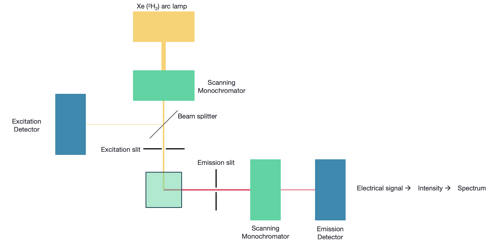
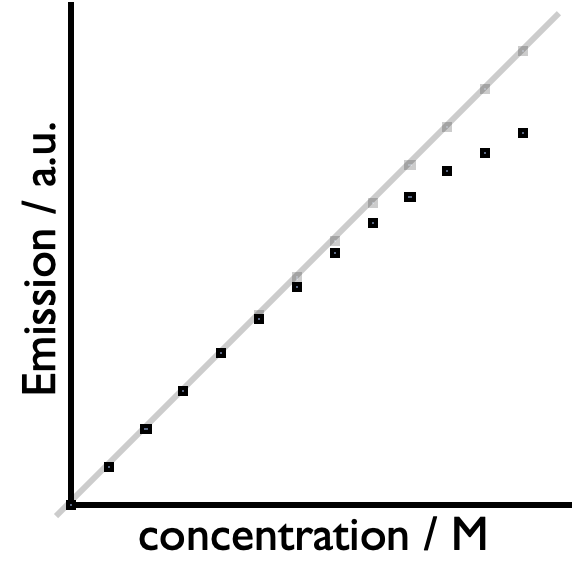

# Fluorescence Excitation and Lifetime {#ch:fluorlif}

Whilst this technique is generally referred to as fluroescence lifetime the principles are equally applicable to longer lifetimes. You will already know fluorescence refers to emission of a photon without a change of spin, phosphorescence, emission of a photon with a change of spin, however I will also use the term emission which I will use either when the mode of emission is either irrelevant or unknown (such as with emission from quantum dots).

<iframe width="555" height="416" src="https://www.youtube.com/embed/auRAt-gRTX4" frameborder="0" allow="accelerometer; autoplay; clipboard-write; encrypted-media; gyroscope; picture-in-picture" allowfullscreen></iframe>

You will already be familiar with the fluorescence, and how emission from an excited state is a spontaneous process following first order kinetics (Table \@ref(tab:photoem)).

Table: (\#tab:photoem) The emission pathways from the excited states within a molecule.

| | | |
|:--------------|:-------------|:---------|
|*'Allowed excited state emission'* | | |
| Singlet-singlet emission| fluorescence | $S_1 \longrightarrow S_0 + h \nu '$|
|*'Forbidden excited state emission'*|||
| Triplet-singlet emission | phosphorescence |$T_1 \longrightarrow S_0 + h \nu ''$|
|*'Other transitions'* | | |
|Internal conversion <br> <Intersystem crossing> <br> <Intersystem crossing>  | (vibrational relaxation) <br> <br> (vibrational relaxation) | $S_1 \longrightarrow S_0 + heat$ <br> $S_1 \longrightarrow T_1 + heat$ <br> $T_1 \longrightarrow S_0 + heat$|
|*Other pathways*| | |
Quenching of excited state <br> <br> <br> Chemistry from excited state| | $S_1 + Q \longrightarrow S_0 + Q +heat$ <br> $S_1 + Q \longrightarrow S_0 + Q^\ast +heat$ <br> $T_1 + Q \longrightarrow S_0 + Q +heat$ <br> $T_1 + Q \longrightarrow S_0 + Q^\ast +heat$ <br> $S_1 \longrightarrow$ new/changed molecule |

However, it can be the case that there is more than one emissive deactivation process from an excited state, each being a first order process.

## Steady State fluorescence

Fluorimeters have two modes of operation, one mode where the excitation wavelength is fixed and the emission is scanned, the version of the technique which we usually think of. The second technique is discussed in section \@ref(sec:excitation), where the emission wavelength is fixed and the excitation is scanned.

```{r echo=FALSE, fluorch, out.width='80%', fig.show='hold', fig.align='center', fig.cap='A fluorimeter with a scanning excitation and emission monochromator, sources are usually xenon arc lamps, and detectors PMTs.'}

```

This necessitates two monochromators, although the most simple instruments will just use band pass filters for excitaiton and emission (and you may have used these instruments in the lab). Fluorescence is measured orthogonally to the excitation, reducing optical artifacts and allowing easy separation of the incident and excident light. Monochromators include slits, which may be used to alter the intensity of incident light reaching the detector (or sample), but this also affects what fine details may be observed in the spectrum.

```{r echo=FALSE, waterramanslits, out.width='60%', fig.show='hold', fig.align='center', fig.cap='The slits in a monochromator affect the both the intensity of light reaching a detector but also the band pass.'}
knitr::include_graphics("images/waterramanslits.png")
```

Detectors in fluorimetry are usually PMTs, however some instruments now use CCDs. Both may be easily saturated, if this occurs there are a number of possible methods to affect the intensity of the signal, including changing the slit widths, changing the voltage on the PMT, reducing the integration time (steady state), slowing the incident pulse rate (time resolved), or changing the concentration of the sample. Conversely we can increase the signal using the same variables, this is the case with signal to noise where the signal increases with $\sqrt{t}$ (or other variable), so quadrupling the integration time would increase the signal relative to the noise by two. However, care should be taken to ensure concentrations always fall in the linear region of the Beer-Lambert law.

```{r echo=FALSE, saturation, out.width='40%', fig.show='hold', fig.align='center', fig.cap='Both CCDs and PMTs are easily saturated where the emission recorded is lower than would be predicted by the Beer-Lambert law.'}

```

When we refer to fluorescence spectroscopy we are normally referring to steady state emisssion spectroscopy. This is the case where we have constant illumination of our sample and we generate a 'steady state' of excited molecules.

### Kasha's rule

We have already seen from earlier courses that the quantum yield of emission is independent of the excitation wavelength (this is Kasha's rule).

```{r echo=FALSE, kasha, out.width='800%', fig.show='hold', fig.align='center', fig.cap='The absorbance (left) and emmission (right) of rhodamine 6G, the intensity of the emission depends on the absorbance at the excitation wavelength. The spectra have been normalised such that the absorbance at the maximum and emission at that excitation wavelength are the same size.'}
knitr::include_graphics("images/kasha.png")
```

This also gives us another way to change the intensity of emission from a sample, by changing the excitation wavelength. 

## Excitation {#sec:excitation}

In earlier courses we have come across energy transfer processes (FRET and Dexter) whereby we said that there could be energy transfer from a donor to an acceptor at a distance, all that was requried was an overlap integral between the emission of the donor and absorption of the acceptor and alignment of the transition dipole moments in each molecule.

```{r echo=FALSE, FRET, out.width='60%', fig.show='hold', fig.align='center', fig.cap='The absorbance and emission of a donor and acceptor with the highlighted region being the spectral overlap integral which allows for energy transfer between the two species.'}

```

Excitation spectroscopy can be used to see if this energy transfer is occuring because if we fix our emission monochromator to a wavelength only emitted by the acceptor and scan our absorbance we may see a spectrum which matches up to that of the donor molecule.

```{r echo=FALSE, FRET2, out.width='60%', fig.show='hold', fig.align='center', fig.cap='If energy transfer is occuring in a system we can see this by looking at the emission of the acceptor and scanning the excitation wavelengths, if the donor profile is observed it must be absorbing energy and transferring it to the donor.'}
knitr::include_graphics("images/FRET2.png")
```

The stronger the coupling between donor and acceptor the larger the observed peak of the donor in the excitation spectra (figure\@ref(fig:FRET2)).If you recall from your [previous photochemistry studies](https://chemfd.github.io/Photochemistry_2/ch-Quench.html#sec:forster) the rate of energy transfer is distance dependent, and so we can use FRET to study structure, such as the melting of DNA.

## Time resolved fluorescence

Emission from an excited state is a spontaneous first order process, what we haven't considered before is the possibility of more than one first order component of decay due to a difference in environment or differences in the chromophore.

Bi- and multi- exponential decays are infact quite normal, and there may also be components from second order quenching. When we are refering to lifetime it is the time taken for the concentration of excited state to fall to 1/e of its initial concentration.

There should be correlation between the steady state intensity and lifetime, for example in  figure \@ref(fig:lifetimeSS) the large increase in intensity of the steady state emission intensity of YO-Pro-1 corresponds to an increase in the measured lifetime of the same size (and consequently an identical increase in the quantum yield of emission).

```{r echo=FALSE, lifetimeSS, out.width='60%', fig.show='hold', fig.align='center', fig.cap='The emission of YO-Pro-1 iodide when bound to DNA (pink) and when in free solution (blue), the steady state intensity  when bound to DNA is 1200 times larger than in free solution, this corresponds to an increase in the fluorescence lifetime from 2 ps in free solution to 2.4 ns when bound to DNA.'}
knitr::include_graphics("images/lifetimeSS.png")
```

Fluorescence lifetimes are just a linear combination of the exponential decays just as we saw in equation \@ref(eq:polyexp) with the flash photolysis.

There are four principle ways of undertaking fluorescence lifetime measurements:

- time domain: measure the intensity of teh signal after an excitation pulse, this technique is usually only used for long (phosphorescent) lifetimes

- phase domain: looking at how modulation ratio changes... this technique is very mathematical to understand and very fiddly to work with, there is a good description in Lackowicz, Principles of Fluorescence Spectroscopy

- pulse streak : cameras offset the signal over an area detector this technique can work with very fast emission lifetimes (ps)

- TCSPC (time correlated single photon counting): the arrival of single photons is detected after each excitation pulse with many thousands of measurements taken. This technique is slow but is very accurate and sensitive

the final common method of measuring emission lifetimes is only used for ultrafast (fs-ps) measurements

- fluorescence up conversion: fluorescence is 'gated' (using a Kerr gate) to only be allowed through after certain time delays

### TCSPC

<iframe width="555" height="416" src="https://www.youtube.com/embed/gWuCHRGNTAM" frameborder="0" allow="accelerometer; autoplay; clipboard-write; encrypted-media; gyroscope; picture-in-picture" allowfullscreen></iframe>

TCSPC counts individual emitted photons and measures the time delay from the excitation pulse to the photon arriving at the detector. Since we only want a single photon to arrive at the detector at any time many measurements will not record any photon arriving.

```{r echo=FALSE, singlephoton, out.width='60%', fig.show='hold', fig.align='center', fig.cap='Single photon counting data, each pulse shows the time delay of a single photon arriving at the detector, as can be seen many measurments do not record any photon arriving at the detector.'}
knitr::include_graphics("images/singlephoton.png")
```

## Case study where lifetime and steady state don't match

It can be the case that the changes in measured lifetime and steady state emission do not match, however there are a couple of cases which help explain this disparity.

The first of these is due to the difficulty of measuring and fitting poly-exponential decays.

The second is the limitations of the equipment in that if you are measuring ns lifetimes you will not be able to also record fs lifetimes.

This is seen in the case reactions such as energy or electron transfer which are strongly distant dependent, if you look at 'average' behaviour in the steady state and measure the lifetimes the data do not match. However if you model the lifetime of the system it does match (but has very short, unmeasurable, lifetimes that cannot be recorded).

## Workshop task

You will find some slides on moodle which contain some data from a a paper by Netzel et al. which looks at the fluorescnece behaviours of a family of dyes in free solution and when bound to DNA.

As with previous workshops the a discussion is included but try to work through the questions on your own before the workshop session. I have also included intro (and discussion) videos on moodle too.


## Questions  

<iframe src="http://workitoutwithapencil.xyz/wp-admin/admin-ajax.php?action=h5p_embed&id=4" width="522" height="438" frameborder="0" allowfullscreen="allowfullscreen"></iframe><script src="http://workitoutwithapencil.xyz/wp-content/plugins/h5p/h5p-php-library/js/h5p-resizer.js" charset="UTF-8"></script>

<iframe src="http://workitoutwithapencil.xyz/wp-admin/admin-ajax.php?action=h5p_embed&id=5" width="522" height="475" frameborder="0" allowfullscreen="allowfullscreen"></iframe><script src="http://workitoutwithapencil.xyz/wp-content/plugins/h5p/h5p-php-library/js/h5p-resizer.js" charset="UTF-8"></script>
