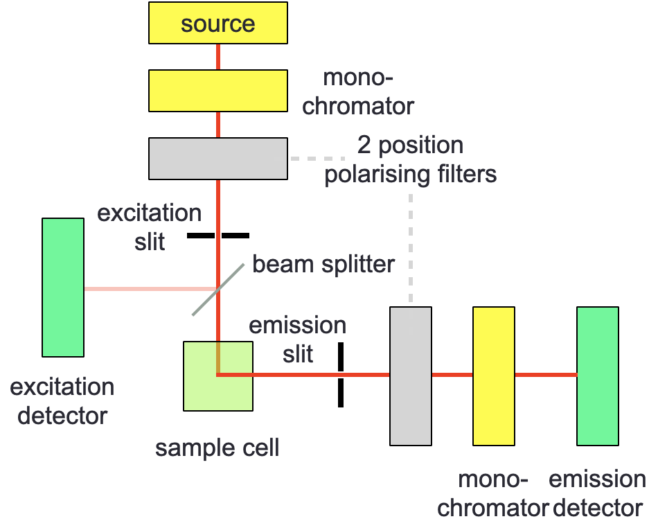
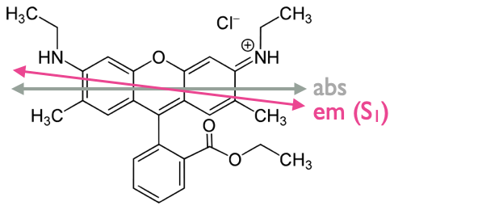
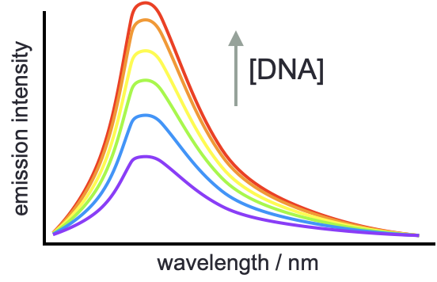
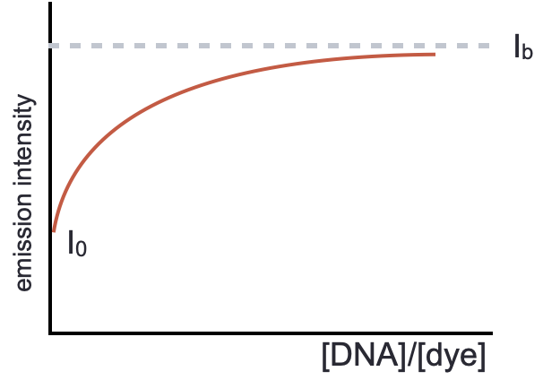

# Fluorescence Anisotropy & Applications of Fluorescence {#ch:fluorother}

## Fluorescence anisotropy

Just as we modified our basic spectroscopy of absorbance to look at the effect of polarisation, we can also modifiy fluorescence to look at the effect of polarisation, this modified technique is called 'fluorescence anisotropy'. The technique can be used in both the steady state and in lifetime studies.

```{r echo=FALSE, anisotropy, out.width='80%', fig.show='hold', fig.align='center', fig.cap='A standard or lifetime fluorimeter may be modified by the addition of two two-position polarising filters -  incident light is polarised in eithter a vertical (V) or horizontal (H) direction, excident light is then measured in each of these two polarisations.'}

```

In fluorescence anisotropy the fluorimeter is modified by the inclusion of two 'two-position' polarising filters (figure \@ref(fig:anisotropy)), each of which can be in either a horizontal (H) or vertical (V) position. Spectra are measured in each of the four combinations (HH, HV, VH & VV). The fluorescence anisotropy ($r$) can then be calculated:

\begin{equation}
r=\frac{I_{VV}-GI_{VH}}{I_{VV}+2GI_{VH}}
(\#eq:anisotropy)
\end{equation}

(the other 'set' of measurements (HH & HV) are used as comparison to ensure that 'unbiased' intensities of fluorescent light are recorded with no artifacts of the response of either the monochromator or other optics in the system).

The term $G$ in equation \@ref(eq:anisotropy) is a response factor for the instrument which normalises the detector for any differences in  response against the sensitivity of the detector for light polarised in the horizontal and vertical directions. Instruments do not return individual intensities of polarisation, but instead just report values of $r$ directly.

```{r echo=FALSE, transdipoles, out.width='80%', fig.show='hold', fig.align='center', fig.cap='The chromaphore rhoadamine 6G has a small offset in the transition dipole omoment of HOMO-LUMO absorbance and fluorescence emisison..'}

```

We have seen previously that each of the absorbance transitions (from S~0~ to S~1~, S~2~, S~3~...) occurs at a different angle (relative to the principle axis in the molecule), and that Kasha's rule states that all emission occurs from the vibrationally relaxed lowest excited state of that spin multiplicity (or there is just a single emission transition). 

Anisotropy measurements can be used to determine the offset in the transition dipoles of the absorbance and emission transitions within a molecule. The largest 'anisotropy' measurements occur when these transitions are 'co-linear'.

\begin{equation}
r_0=\frac{2}{5}\left(\frac{3 \cos ^2 \beta -1}{2} \right)
(\#eq:anisotropyeqn)
\end{equation}

Table: (\#tab:anisotropyangle) The measured anisotropy for a selectrion of different angles between the transition dipole moments of excitation and emission, ($\beta$)

|$\beta$ / $^\circ$|$r_0$|
|:----:|:----:|
| 0| 0.40 |
|45 |0.10 |
| 54.7| 0.00|
| 90| -0.20|

### Time-resolved anisotropy

Time-resolved anisotropy can be used to study the depolarisation of emission from a rotating chromophore, when we excite chromophores using polarised light only chromophores with the transition dipole moment aligned with the excitation light are excited. Molecules are always in motion, large molecules move more slowly than small molecules. 

After excitation the molecules in motion rotate, very small molecules (like chromophores) rotate very quickly and any isotropic information is lost very quickly (usually more fast than the fluorescence emission),  however large molecules like proteins rotate much more slowly, and the rate of depolarisation is consequently considerably slower.

To give some context, small molecules (like most typical chromophores) will rotate in around 50-100 ps, and most fluorescence lifetimes are in the 1-5 ns region.

The rate of this depolarisation depends upon the temperature of the system ($T$), the viscosity of the solution ($\eta$) and the volume of excited species(V).

\begin{equation}
r(t)=r_\infty + (r_0-r_\infty)e^{-\frac{t}{\theta}}
(\#eq:anisotropytime)
\end{equation}

where:

\begin{equation}
\theta = \frac{\eta V}{RT}
(\#eq:correlationtime)
\end{equation}

Equation \@ref(eq:correlationtime) has been simplified for a spherical molecule, but with small changes to this equation it it possible to model for non-spherical systems.

The Perrin equation shows the time dependence of rotational deactivation for a spherical rotor, where $\tau$ is the fluorescence lifetime:

\begin{equation}
\frac{r_0}{r}=1+\frac{\tau}{\theta}
(\#eq:perrin)
\end{equation}

Globular proteins have a correlation time which may be approximated to be proportional to the molecular weight of the protein.

Steady state anisotropy only gives 'average' anisotropy of the sample, considerably more information may be determined with fluorescence lifetime anisotropy studies, and since laser sources are already polarised experiments are very simple.

### FRET

Another use of anisotropy is in resonance energy transfer studies. Energy transfer relies on a dipole dipole interaction between a donor & acceptor chromophore, but showing that it is an energy transfer and not emission and reabsorption of a photon can be shown by anisotripic studies.

The depolarisation of anisotripic light is far more efficient in energy transfer systems than would be expected for systems which involve emission and reabsorption.

## Application of fluorescence

Both isotropic fluroescence and fluorescence anisotropy may be used to determine thermodynamic properties of the binding between chromophores and other molecules (typically DNA or proteins), this only works if there is an enhancement of the emisison upon binding to the target molecule (figure \@ref(fig:emissionenhancement)).

There exists and equilibrium between the complex (DNA used as an example, but it is true of all systems), and the free molecules:

\begin{equation}
K_b=\frac{[\textrm{dye:DNA}]}{[\textrm{dye}][\textrm{DNA}]}
(\#eq:scatcheqbm)
\end{equation}


```{r echo=FALSE, emissionenhancement, out.width='80%', fig.show='hold', fig.align='center', fig.cap='The enhancement of emisison when binding to a second molecule may be used to determine the thermodynamics of binding, and the number of binding sites in the system.'}

```

If we consider the emission at a single wavelength then we can combine information about the emission of unbound dye ($I_0$), the emission when all dye is bound (which is estimated from an asymptotic model, $I_b$) with the measured emission at that point ($I_x$) to determine the proportion of dye in complex (equation \@ref(eq:binding), figure \@ref(fig:enhancement)).

If we want to undertake these experiments it is important that the concentration of dye is constant so that there are no concentration effects on the emission intensity.

Recall P/D is the ratio of 'phosphate' (or DNA bases) and dye.

```{r echo=FALSE, enhancement, out.width='80%', fig.show='hold', fig.align='center', fig.cap='At a fixed wavelength if we plot the emission intensity against P/D ratio the emission intensity increases as the proportion of bound dye increases, this reaches a maximum when all dye is bound to the DNA.'}

```

\begin{equation}
\alpha = \frac{I_x - I_0}{I_b-I_0}
(\#eq:binding)
\end{equation}

From this we can say that the concentration of bound dye, $[D]_b=\alpha [D]t$ (where $[D]_t$ is the total concentration of dye), and consequently the concentration of unbound (or free) dye is $[D]_f=(1-\alpha) [D]t$.

We can then define $r$ (this is a different r from anisotropy - I know it's a pain) as (where [DNA} is the concentration of DNA bases):

\begin{equation}
r = \frac{[D]_b}{[\textrm{DNA}]}=\alpha \frac{[D]_t}{[DNA]}
(\#eq:r)
\end{equation}

The Scatchard plot then gives information on the equilibrium constant of binding ($K_b$), and number of binding sites ($B$) per base.

\begin{equation}
\frac{r}{[D]_f} = K_b B - K_b r
(\#eq:scatchard)
\end{equation}

## Workshop task

The final workshop of this course looks at the binding of a chromophore to a protein and uses a Scatchard analysis on fluorescence anisotropy data. This paper has been published in an education journal and so is consequently much more accessible than many research papers; consequently I would like for you to read this (very short) paper, which can be found on Moodle.

When reading the paper consider the following questions:

- What are the key findings?
- What was the experimental configuration?
- Characteristics of the binders?
- What do steady state and time resolved measurements tell you?
- Can you explain the findings in your own words?
- How are the conclusions arrived at?

As before we will discuss this as a group (and I will summarise our discussions).
